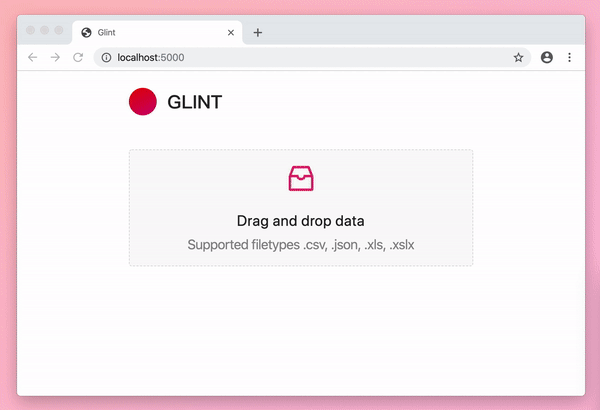

# ❇️ Glint

## Glint uses AI to tell the story of your data. 

Use the magic of AI to learn more about your data. Drag your data in, and see Glint tell a story from your CSV file. 



### Setup
You can get up and running quickly with [Docker](https://docs.docker.com/docker-for-mac/install/). Once you have docker running on your computer, you can run the following command to build and run Glint:
```bash
docker-compose up
```

You can now access it through [your browser](http://localhost:5000) 😄

---

The below section details how you can get a development server running. You won't need to do this unless you want to fiddle with the internals of Glint. If you do want to modify the files, then it would be best to follow the steps below.

#### Backend
The backend is written in flask and relies on redis-server. Whenever there is a new file uploaded, Glint will run a series of jupyter notebooks using papermill. The output will be saved as json files that can be served to the consumer.

```bash
# install requirements in a python3 environment
pip install -r requirements.txt

# start redis server
redis-server &

# start app.py for static files and API
python app.py &

# start update.py for running notebooks asyncronously
python update.py
```

#### Frontend
The frontend uses react to provide a user interface to Glint. It is compiled with webpack and then served through the flask backend - you only need to run the code below if you're going to modify the frontend.

```bash
npm i
npm run watch
```

---

Built with love in San Francisco ❤️

